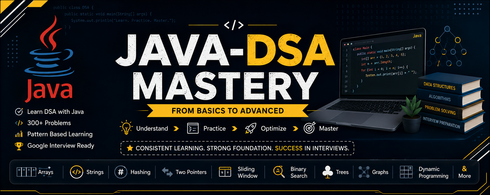
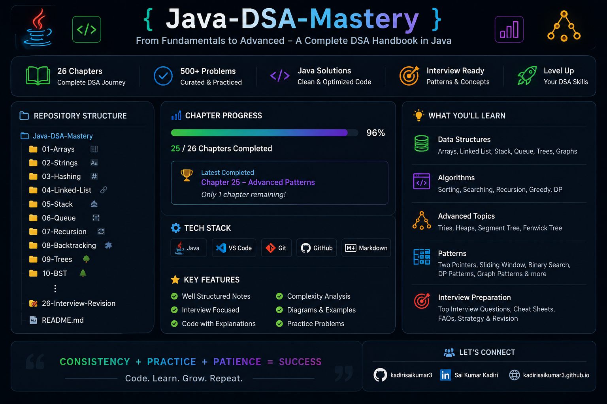

# 🚀 Java-DSA-Mastery

<p align="center">
  
</p>

<p align="center">


</p>

---

# 📘 About

**Java-DSA-Mastery** is a complete Data Structures & Algorithms repository built using **Java**, designed for:

- Google SDE Preparation
- Product-Based Companies
- Coding Interviews
- Placement Preparation
- Competitive Programming
- University Revision

The repository contains structured notes, Java implementations, interview questions, cheat sheets, mind maps, and coding patterns from beginner to advanced level.

---

# 🎯 Repository Goals

- Learn DSA from scratch
- Master Java implementations
- Build problem-solving skills
- Prepare for coding interviews
- Crack Google and product-based company interviews
- Create a high-quality open-source learning resource

---

# 📂 Repository Structure

```text
Java-DSA-Mastery
│
├── Assets
├── Docs
│
├── 01-Time-and-Space-Complexity
├── 02-Arrays
├── 03-Strings
├── 04-Hashing
├── 05-Two-Pointers
├── 06-Sliding-Window
├── 07-Binary-Search
├── 08-Recursion
├── 09-Backtracking
├── 10-Linked-List
├── 11-Stack
├── 12-Queue
├── 13-Trees
├── 14-Binary-Search-Tree
├── 15-Heaps
├── 16-Tries
├── 17-Graphs
├── 18-Greedy
├── 19-Dynamic-Programming
├── 20-Bit-Manipulation
├── 21-Math
├── 22-Union-Find
├── 23-Segment-Tree
├── 24-Fenwick-Tree
├── 25-Advanced-Patterns
└── 26-Interview-Revision
```

---

# 📚 Learning Progress

| Chapter | Topic                   | Status |
|---------|-------------------------|--------|
| ✅ 01 | Time & Space Complexity   | Completed |
| ✅ 02 | Arrays                    | Completed |
| ✅ 03 | Strings                   | Completed |
| ✅ 04 | Hashing                   | Completed |
| ✅ 05 | Two Pointers              | Completed |
| ✅ 06 | Sliding Window            | Completed |
| ✅ 07 | Binary Search             | Completed |
| ✅ 08 | Recursion                 | Completed |
| ✅ 09 | Backtracking              | Completed |
| ✅ 10 | Linked List               | Completed |
| ✅ 11 | Stack                     | Completed |
| ✅ 12 | Queue                     | Completed |
| ✅ 13 | Trees                     | Completed |
| ✅ 14 | Binary Search Tree        | Completed |
| ⏳ 15 | Heaps                     | Coming Soon |
| ⏳ 16 | Tries                     | Coming Soon |
| ⏳ 17 | Graphs                    | Coming Soon |
| ⏳ 18 | Greedy                    | Coming Soon |
| ⏳ 19 | Dynamic Programming       | Coming Soon |
| ⏳ 20 | Bit Manipulation          | Coming Soon |
| ⏳ 21 | Math                      | Coming Soon |
| ⏳ 22 | Union Find                | Coming Soon |
| ⏳ 23 | Segment Tree              | Coming Soon |
| ⏳ 24 | Fenwick Tree              | Coming Soon |
| ⏳ 25 | Advanced Patterns         | Coming Soon |
| ⏳ 26 | Interview Revision        | Coming Soon |

---

# 🏆 Features

- ✅ Beginner Friendly
- ✅ Java Solutions
- ✅ Pattern Recognition
- ✅ Brute Force → Better → Optimal
- ✅ Time & Space Complexity
- ✅ Google Interview Questions
- ✅ Cheat Sheets
- ✅ Mind Maps
- ✅ Interview Tips
- ✅ Revision Notes

---

# 📸 Repository Preview

<p align="center">

</p>

---

# 🚀 Roadmap

- Complete all 26 chapters
- Add 300+ Java examples
- Add 250+ interview questions
- Add visual cheat sheets
- Add coding patterns
- Add Google interview notes
- Add revision guides

---

# 🤝 Contributing

Contributions are welcome!

If you would like to improve this repository:

1. Fork the repository
2. Create a feature branch
3. Commit your changes
4. Open a Pull Request

---

# ⭐ Support

If you found this repository useful,

⭐ Star this repository

🍴 Fork it

📢 Share it with others

---

# 👨‍💻 Author

**Sai Kumar Kadiri**

Aspiring Software Engineer | Java Developer

- GitHub: https://github.com/kadirisaikumar3
- LinkedIn: https://www.linkedin.com/in/saikumarkadiri/

---

## 📄 License

This project is licensed under the MIT License.

---

<p align="center">

### 🚀 Happy Coding!

**Practice • Learn • Build • Repeat**

</p>